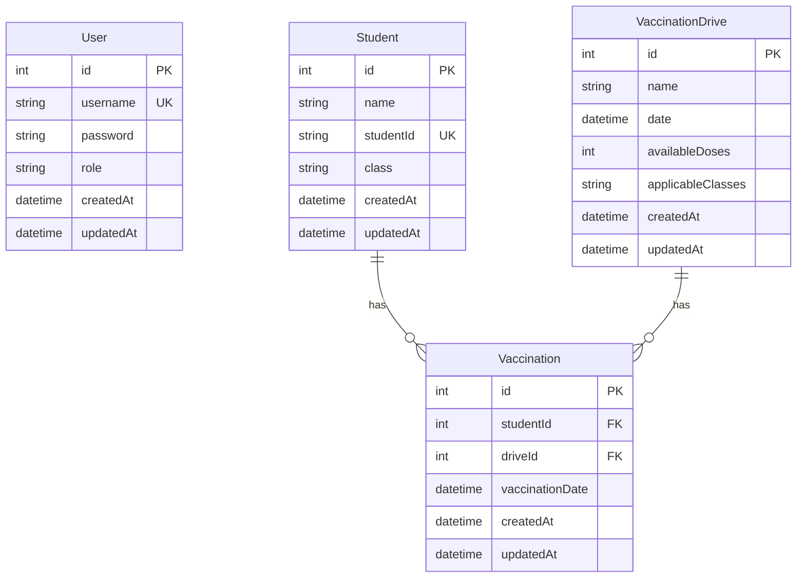

# School Vaccination Portal Database Schema

This document provides a visual representation of the database schema for the School Vaccination Portal application.

## Entity Relationship Diagram (ERD)

## Table Descriptions

### User

Stores user account information for system access.

| Column    | Type     | Constraints              | Description                  |
| --------- | -------- | ------------------------ | ---------------------------- |
| id        | INTEGER  | PK, AUTO_INCREMENT       | Unique identifier            |
| username  | STRING   | NOT NULL, UNIQUE         | User's login name            |
| password  | STRING   | NOT NULL                 | Hashed password              |
| role      | STRING   | NOT NULL, DEFAULT 'user' | User role (admin/user)       |
| createdAt | DATETIME | NOT NULL                 | Record creation timestamp    |
| updatedAt | DATETIME | NOT NULL                 | Record last update timestamp |

### Student

Stores information about students in the school.

| Column    | Type     | Constraints        | Description                  |
| --------- | -------- | ------------------ | ---------------------------- |
| id        | INTEGER  | PK, AUTO_INCREMENT | Unique identifier            |
| name      | STRING   | NOT NULL           | Student's full name          |
| studentId | STRING   | NOT NULL, UNIQUE   | School-assigned student ID   |
| class     | STRING   | NOT NULL           | Student's class/grade        |
| createdAt | DATETIME | NOT NULL           | Record creation timestamp    |
| updatedAt | DATETIME | NOT NULL           | Record last update timestamp |

### VaccinationDrive

Stores information about vaccination drives organized by the school.

| Column            | Type     | Constraints        | Description                                |
| ----------------- | -------- | ------------------ | ------------------------------------------ |
| id                | INTEGER  | PK, AUTO_INCREMENT | Unique identifier                          |
| name              | STRING   | NOT NULL           | Name of the vaccination drive              |
| date              | DATETIME | NOT NULL           | Scheduled date of the drive                |
| availableDoses    | INTEGER  | NOT NULL           | Number of vaccine doses available          |
| applicableClasses | STRING   | NOT NULL           | Comma-separated list of applicable classes |
| createdAt         | DATETIME | NOT NULL           | Record creation timestamp                  |
| updatedAt         | DATETIME | NOT NULL           | Record last update timestamp               |

### Vaccination

Records individual student vaccinations during drives.

| Column          | Type     | Constraints        | Description                            |
| --------------- | -------- | ------------------ | -------------------------------------- |
| id              | INTEGER  | PK, AUTO_INCREMENT | Unique identifier                      |
| studentId       | INTEGER  | NOT NULL, FK       | Reference to Student                   |
| driveId         | INTEGER  | NOT NULL, FK       | Reference to VaccinationDrive          |
| vaccinationDate | DATETIME | NOT NULL           | Date when vaccination was administered |
| createdAt       | DATETIME | NOT NULL           | Record creation timestamp              |
| updatedAt       | DATETIME | NOT NULL           | Record last update timestamp           |

## Relationships

1. **Student to Vaccination**: One-to-Many

    - A student can have multiple vaccination records
    - Each vaccination record belongs to exactly one student

2. **VaccinationDrive to Vaccination**: One-to-Many
    - A vaccination drive can have multiple vaccination records
    - Each vaccination record belongs to exactly one drive

## Indexes

-   **User**: username (UNIQUE)
-   **Student**: studentId (UNIQUE)
-   **Vaccination**: (studentId, driveId) (UNIQUE) - Ensures a student can only be vaccinated once per drive

## Notes

-   All tables include `createdAt` and `updatedAt` timestamps for auditing
-   Passwords are stored as bcrypt hashes, not plain text
-   The `applicableClasses` field in VaccinationDrive stores class identifiers as a comma-separated string
-   The Vaccination table has a unique constraint on (studentId, driveId) to prevent duplicate vaccinations
