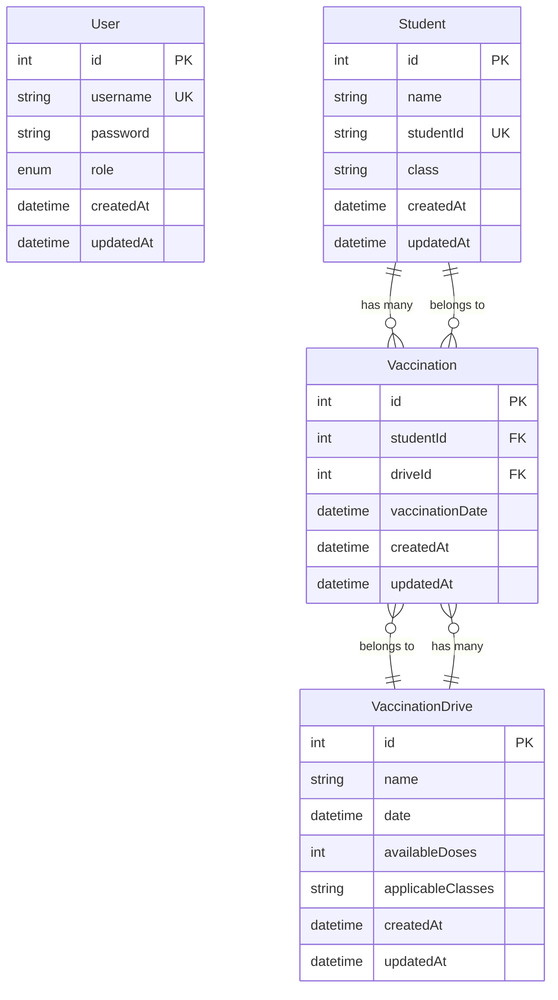

# School Vaccination Portal

A full-stack web application for managing and tracking vaccination drives in a school. This application helps school administrators and coordinators efficiently manage student vaccinations, schedule vaccination drives, and generate reports.

## 🎯 Features

### Authentication & Authorization

-   Secure login system for school coordinators and administrators
-   Role-based access control (Admin and Coordinator roles)
-   JWT-based authentication with secure password hashing

### Dashboard

-   Real-time overview of vaccination statistics
-   Upcoming vaccination drives calendar
-   Student vaccination rate visualization
-   Quick access to key metrics and reports

### Student Management

-   Add/edit individual student records
-   Bulk import students via CSV upload
-   Search and filter students by name, ID, or class
-   View student vaccination history
-   Prevent duplicate student entries

### Vaccination Drive Management

-   Schedule new vaccination drives
-   Set available doses and applicable classes
-   Track drive status (upcoming, ongoing, completed)
-   Prevent scheduling conflicts
-   Cannot modify or delete past drives

### Vaccination Records

-   Record student vaccinations
-   Prevent duplicate vaccinations
-   Track vaccination history
-   Filter and sort vaccination records
-   Export vaccination data

### Reports & Analytics

-   Generate comprehensive vaccination reports
-   Export data in Excel format
-   Filter reports by date range, class, or vaccine type
-   View vaccination statistics and trends

### Additional Features

-   View vaccination history and statistics
-   Export data to CSV
-   Multi-language support (English as of now, can be exteneded)

## 🎨 Wireframes & Design

View the complete wireframes and design specifications:
[School Vaccination Portal Wireframes](https://www.figma.com/design/FKKOeGIsAGNooBQFPSzrsA/School-Vaccination-Portal?node-id=0-1&t=TNLfARnD8G4x5Ivm-1)

## 🛠 Tech Stack

### Frontend

-   **React** with **TypeScript** for type-safe development
-   **Vite** for fast development and optimized builds
-   **Material UI** for consistent and responsive components
-   **React Router** for client-side routing
-   **Axios** for API communication
-   **React Query** for efficient data fetching and caching
-   **Chart.js** for data visualization
-   **Formik** & **Yup** for form handling and validation

### Backend

-   **Node.js** with **Express** for the server
-   **TypeScript** for type safety
-   **SQLite** database with **Sequelize ORM**
-   **JWT** for secure authentication
-   **Bcrypt** for password hashing
-   **Multer** for file uploads
-   **ExcelJS** for report generation
-   **Joi** for request validation

## 📁 Project Structure

```
school-vaccination-portal/
├── frontend/                # React frontend
│   ├── src/
│   │   ├── components/     # Reusable UI components
│   │   │   ├── common/     # Shared components
│   │   │   ├── layout/     # Layout components
│   │   │   └── forms/      # Form components
│   │   ├── pages/         # Page components
│   │   ├── services/      # API services
│   │   ├── hooks/         # Custom React hooks
│   │   ├── utils/         # Utility functions
│   │   ├── types/         # TypeScript types
│   │   └── context/       # React context
│   ├── public/            # Static assets
│   └── index.html         # Entry HTML
│
├── backend/               # Node.js backend
│   ├── src/
│   │   ├── config/       # Configuration files
│   │   ├── controllers/  # Request handlers
│   │   ├── middlewares/  # Express middlewares
│   │   ├── models/       # Sequelize models
│   │   ├── routes/       # API routes
│   │   ├── services/     # Business logic
│   │   ├── utils/        # Utility functions
│   │   ├── types/        # TypeScript types
│   │   └── seeders/      # Sample data seeders
│   ├── uploads/          # File upload directory
│   └── reports/          # Generated reports
│
└── package.json          # Root package.json
```

## 🎥 Demo Videos

### Video 1

[Video 1 link](https://wilpbitspilaniacin0-my.sharepoint.com/:v:/g/personal/2024tm93020_wilp_bits-pilani_ac_in/Ebhk5C1WUuxPlm-0SMZSfTUBb4ESWWd7S3uIU1HigoC9Nw?nav=eyJyZWZlcnJhbEluZm8iOnsicmVmZXJyYWxBcHAiOiJPbmVEcml2ZUZvckJ1c2luZXNzIiwicmVmZXJyYWxBcHBQbGF0Zm9ybSI6IldlYiIsInJlZmVycmFsTW9kZSI6InZpZXciLCJyZWZlcnJhbFZpZXciOiJNeUZpbGVzTGlua0NvcHkifX0&e=ZJ7SOL)

### Video 2

[Video 2 link](https://wilpbitspilaniacin0-my.sharepoint.com/:v:/g/personal/2024tm93020_wilp_bits-pilani_ac_in/EU-ZxzJ-sfxAu268XmXZQB4Br8slGsbh5NifwseIisywEw?nav=eyJyZWZlcnJhbEluZm8iOnsicmVmZXJyYWxBcHAiOiJPbmVEcml2ZUZvckJ1c2luZXNzIiwicmVmZXJyYWxBcHBQbGF0Zm9ybSI6IldlYiIsInJlZmVycmFsTW9kZSI6InZpZXciLCJyZWZlcnJhbFZpZXciOiJNeUZpbGVzTGlua0NvcHkifX0&e=nUyFC3)

## 📊 Database Schema



## 🚀 Getting Started

### Prerequisites

-   Node.js 16+ or Bun runtime
-   Git for version control
-   A modern web browser

### Installation

1. Clone the repository

```bash
git clone https://github.com/yourusername/school-vaccination-portal.git
cd school-vaccination-portal
```

2. Install dependencies

```bash
# Using npm
npm install

# Using Bun (recommended)
bun install
```

3. Set up environment variables

```bash
# Backend (.env)
PORT=3000
JWT_SECRET=your_jwt_secret
NODE_ENV=development

# Frontend (.env)
VITE_API_URL=http://localhost:3000/api
```

### Running the Application

1. Start the development servers

```bash
# Using npm
npm run dev

# Using Bun (recommended)
bun run dev
```

This will start:

-   Backend server at http://localhost:3000
-   Frontend development server at http://localhost:5173

### Database Setup

The application uses SQLite with Sequelize ORM. The database will be automatically created and seeded with sample data in development mode.

To manually manage the database:

```bash
# Seed the database
bun run seed

# Reset the database
bun run reset-db
```

### Default Credentials

-   **Admin**

    -   Username: admin
    -   Password: password123

-   **Coordinator**
    -   Username: coordinator
    -   Password: password123

## 📚 API Documentation

The API documentation is available in the Postman collection located at `backend/postman_collection.json`. Import this file into Postman to view all available endpoints and their usage.

### Key API Endpoints

#### Authentication

-   `POST /api/auth/login` - Login with username and password

#### Students

-   `GET /api/students` - Get all students (with pagination and filtering)
-   `POST /api/students` - Create a new student
-   `PUT /api/students/:id` - Update a student
-   `DELETE /api/students/:id` - Delete a student
-   `POST /api/students/import` - Import students from CSV

#### Vaccination Drives

-   `GET /api/vaccination-drives` - Get all drives
-   `POST /api/vaccination-drives` - Create a new drive
-   `PUT /api/vaccination-drives/:id` - Update a drive
-   `DELETE /api/vaccination-drives/:id` - Delete a drive

#### Vaccinations

-   `GET /api/vaccinations` - Get all vaccinations
-   `POST /api/vaccinations` - Record a new vaccination
-   `GET /api/vaccinations/statistics` - Get vaccination statistics

## 🏗 Building for Production

```bash
# Build both frontend and backend
bun run build

# Start production server
bun run start
```

## 🧪 Testing

```bash
# Run frontend tests
bun run test:frontend

# Run backend tests
bun run test:backend

# Run all tests
bun run test
```
